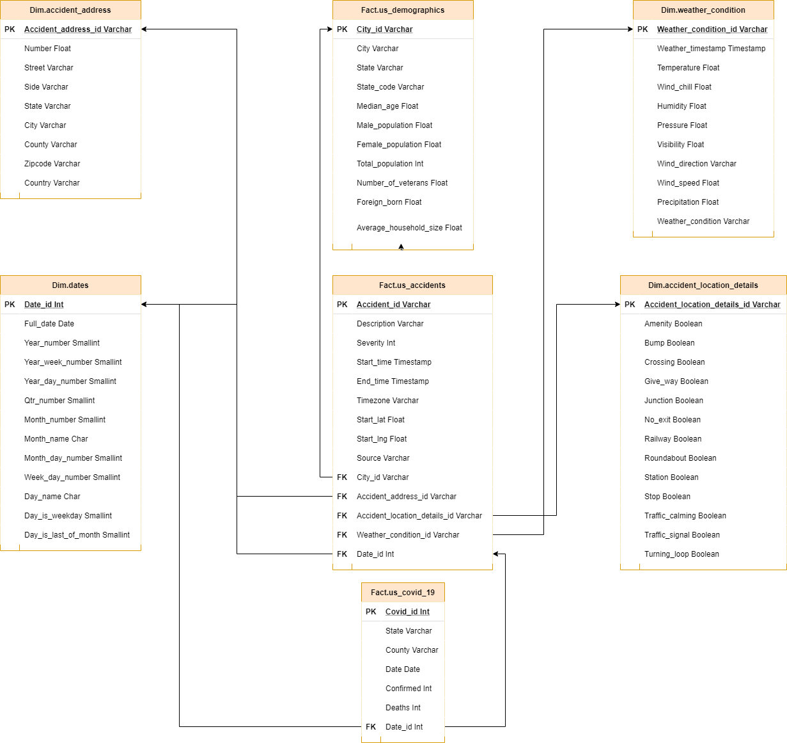

# Data Engineering NanoDegree

## Author
Deivid Robim [Linkedin](https://www.linkedin.com/in/deivid-robim-200b3330/)

### Capstone Project: How COVID-19 impacted U.S Automotive Accidents?

A Automotive Telematics startup, Global Telematics, has grown their traffic data and want to move their processes and data onto the cloud. </br>
Their data resides in S3, in a directory of CSV files representing daily automotive accidents in U.S, as well as a directory with daily U.S COVID-19 data at county level.

As their data engineer, you are tasked with building an ETL pipeline that extracts their data from S3, stages them in Redshift, and transforms data into a set of dimensional tables for their Analytics team to continue finding insights. </br>
Due to a pandemic that started in January 2020, the Analytics Team wants to ingest COVID-19 data to understand how the lockdown in U.S impacted automotive accidents.

### Project Structure
```
Capstone-Project-Data-Engineering-Nanodegree
│   README.md                    # Project description
│   requirements.txt             # Python dependencies
│   docker-compose.yml           # Docker Containers Configuration
└───airflow                      # Airflow home
|   |
│   └───dags                          # Airflow DAGs location
│   |   │ create_datalake_dag.py  # DAG definition
│   |   │ us_accidents_etl_dag.py  # DAG definition
|   |   |
|   └───plugins
│       │
|       └───helpers
|       |   | sql_creates.py  # Sql queries to create objects
|       |   | sql_load.py     # Sql queries to load data into sql tables
|       |
|       └───operators
|       |   | check_s3_file_count.py # CheckS3FileCount
|       |   | create_s3_bucket.py    # CreateS3BucketOperator
|       |   | upload_files_to_s3.py  # UploadFilesToS3Operator
|       |   | data_quality.py    # DataQualityOperator
|       |   | load_table.py      # LoadTableOperator
|       |   | s3_to_redshift.py  # S3ToRedshiftOperator
|___data-profiling
│   | covid-19.html
│   | us-accidents.html
│   | us-cities-demographics.html
|___data
|   |
│   └───raw                          # Raw data is saved here
│   |   └─── covid-19                # Covid-19 data set directory
│   |   └─── us-accidents            # us-accidents data set directory
│   |   └─── us-cities-demographics  # us-cities-demographics data set directory
│   └───split                        # Split data is saved here automatically (Directories are created automatically as well)
|___images
|   | datalake_dag_graph_view.png # DAG Graph View
|   | datalake_dag_trigger.png # DAG Tree View
|___src
|   | create_resources.py # Script to create resources required
|   | delete_resources.py # Script to delete resources created
|   | split_data.py       # Script to split large datasets
|   | dwh.cfg             # Configuration file
```

### Requirements for running locally
* Install [Python3](https://www.python.org/downloads/)
* Install [Docker](https://www.docker.com/)
* Install [Docker Compose](https://docs.docker.com/compose/install/)
* [AWS](https://aws.amazon.com/) Account

### Project Goal
The idea is to create a data lake and a DataWarehouse on AWS, enabling users to analyze accidents data and extract insights.

The main goal of this project is to build an end-to-end data pipeline which is capable to work with big volumes of data.

### Technologies
We are going to store the raw data on Amazon S3, which is is an object storage service that offers industry-leading scalability, availability and durability.

Considering the current data size, we are going to use Amazon Redshift to ingest the data from S3 and perform the ETL process, denormalizing the datasets to create FACT and DIMENSION tables.

Finally, to orchestrate everything, we are going to build a data pipeline using Apache Airflow.
Airflow provides an intuitive UI where we can track the progress and bottlenecks of our pipelines.

### Datasets

We are going to work with 3 datasets:


- [U.S Accidents](https://www.kaggle.com/sobhanmoosavi/us-accidents)
    - This is a countrywide traffic accident dataset, which covers 49 states of the United States.
- [U.S Cities: Demographics](https://public.opendatasoft.com/explore/dataset/us-cities-demographics)
    - This dataset contains information about the demographics of all US cities and census-designated places with a population greater or equal to 65,000.
- [U.S COVID-19](https://www.kaggle.com/imdevskp/corona-virus-report?select=usa_county_wise.csv)
    - This dataset contains information about COVID-19 cases in US at county level.

### Data Exploration
Navigate to "data-profiling" and open the comprehensive Data Profiling for each dataset.

- [US Accidents](data-profiling/)
- [US Cities: Demographics](data-profiling/)
- [US COVID-19](data-profiling/)

### Data Model

The dimensional model consists of seven tables. </br>
The details and relationship between them are listed below:

#### Fact Tables
```
• us_demographics - Provides demographics information about US cities
• us_accidents - Provides the accident details
• us_covid_19 - Provides daily information about COVID-19 in US
```

#### Dimension Tables
```
• accident_address - Provides a unique list addresses based on accidents
• accident_location_details - Provides the accident location details based on the accident address surroundings
• weather_condition - Provides the weather condition at the time of the accident
• dates - Provides timestamps of records broken down into specific units
```

#### Entity Relationship Diagram



### Instructions for running locally

#### Clone repository to local machine
```
git clone https://github.com/drobim-data-engineering/Capstone-Project-Data-Engineering-Nanodegree.git
```

#### Change directory to local repository
```
cd Capstone-Project-Data-Engineering-Nanodegree
```

#### Create python virtual environment
```
python3 -m venv venv             # create virtualenv
source venv/bin/activate         # activate virtualenv
pip install -r requirements.txt  # install requirements (this can take couple of minutes)
```

#### Download data
Download and save the data as followed below:

- [U.S Accidents](https://www.kaggle.com/sobhanmoosavi/us-accidents)
    - data/raw/us-accidents/
- [U.S Cities: Demographics](https://public.opendatasoft.com/explore/dataset/us-cities-demographics)
    - data/raw/us-cities-demographics/
- [U.S COVID-19](https://www.kaggle.com/imdevskp/corona-virus-report?select=usa_county_wise.csv)
    - data/raw/covid-19/

#### Split the data
The script below goes through the directory input by the user and splits the data.
```
cd src/
python -m split_data.py # Split the data into chunks
```
The split data sets are saved on data/split/

#### Edit dwh.cfg file

This file holds the configuration variables used on the scripts to create and configure the AWS resources. </br>
These are the variables the user needs to set up before running the `create_resources.py` script.

```
AWS_ACCESS_KEY = <ENTER AWS ACCESS KEY>   # paste your user Access Key
AWS_SECRET_ACCESS_KEY = <ENTER AWS SECRET KEY>  # paste your user Secret Key
REGION = <ENTER THE AWS REGION> # paste the AWS Region to create resources
VPC_ID = <ENTER VPC ID>  # paste the VPC_ID you want to create the resources (If blank the first VPC on user's AWS account is considered)
```
<b>REMEMBER:</b> Never share your <b>AWS ACCESS KEY & SECRET KEY</b> on scripts.  </br>
This is just an experiment to get familiarized with AWS SDK for Python.

#### Start Airflow Container

Everything is configured in the docker-compose.yml file.
```
cd ..
docker-compose up
```

#### Create AWS Resources
This is the entry point to kick-off a series of processes from creating resources on AWS to creating custom connections on Airflow.
```
cd src/
python -m create_resources.py # Creates required resources
```
The execution of this script incur <b>REAL MONEY</b> costs so be aware of that.

#### Start "Create Datalake" DAG
Navigate to "airflow/dag/create_datalake_dag" and set the variable "datalake_bucket_name", the default is 'us-accidents-datalake'. However, this might crash as S3 Bucket names has to be unique. </br>
Visit the Airflow UI and start the "create_datalake_dag" by switching it state from OFF to ON. </br>
Refresh the page and click on the "trigger dag" button.


Finally, click on "create_datalake_dag" and then on "Graph View" to view the current DAG state. </br>
This pipeline creates the S3 bucket for our data lake and uploads the files from local machine. </br>
Wait until the pipeline has successfully completed (it should take around 15-20 minutes).


#### Start "Accident ETL" DAG
Go back to Airflow home page and start the "us_accident_etl_dag" by switching it state from OFF to ON. </br>
Refresh the page and click on the "trigger dag" button.


Finally, click on "us_accident_etl_dag" and then on "Graph View" to view the current DAG state. </br>
This pipeline creates the dimensional model we are going to use for the analysis, it creates database schema, dimension and fact tables on Redshift and loads data from S3 to Redshift </br>
Wait until the pipeline has successfully completed.


#### Delete Resources
Please make sure to run the script below once the process is completed.

```
cd src/
python -m delete_resources.py # Entry point to kick-off a series of processes to delete resources resources on AWS and connections on Airflow.
```

## Addressing Other Scenarios
1. The data was increased by 100x

- <b>Data Lake</b>
    - The data lake would not require significant changes since we have a flexible schema and S3 is meant for storing big data.

- <b>ETL Process</b>
    - Regarding the ETL job, it would require moving to a EMR Cluster on AWS running Apache Spark, which is optimize for Big Data Processing.

- <b>Orchestration</b>
    - The Airflow container is currently running on a single container on our local machine. In a production environment, Airflow would be running on a cluster of machines likely coordinated by Kubernetes.

2. The pipelines would be run on a daily basis by 7 am every day.
    - We can schedule our Airflow pipelines so that they follow this pattern.
    - Airflow will store useful statistics regarding job status and we can easily spot faults in the pipeline.

3. The database needed to be accessed by 100+ people.
    - Amazon Redshift should be able to handle 100+ people querying the Datawarehouse. The user can also increase the number of instances at any time to satisfy high demand.
